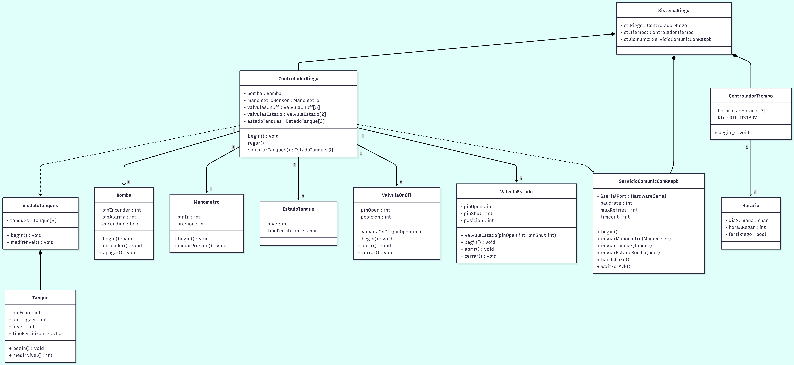

# Smart Greenhouse Irrigation System - Arduino

## Project Overview

This project implements an **automated fertigation system** for greenhouses with intelligent scheduling and monitoring capabilities.

## System Architecture

### Core Components

- **Irrigation Controller**: Manages the watering schedule using a state machine triggered by predefined time-based events
- **Tank Management Module**: Monitors and administers tank levels, responds to level measurement requests from the irrigation controller
- **Pump System**: Handles water distribution with failure detection capabilities
- **Pressure Monitoring**: Tracks manometer pressure readings during irrigation operations

### Key Features

- **Automated Watering**: Executes irrigation routines based on configurable schedules
- **Real-time Monitoring**: Continuously reports system status including:
  - Tank water levels
  - Pump operational status and failures
  - Pressure readings during irrigation cycles
- **State Machine Logic**: Controls irrigation flow through defined operational states
- **Event-Driven Architecture**: Responsive system that reacts to scheduled events and controller requests

### Workflow

1. Scheduler triggers irrigation event at defined times
2. Irrigation controller initiates state machine
3. Tank module measures and reports current levels
4. Pump activates with pressure monitoring
5. System logs operational data and alerts on anomalies

## UML Class Diagram

